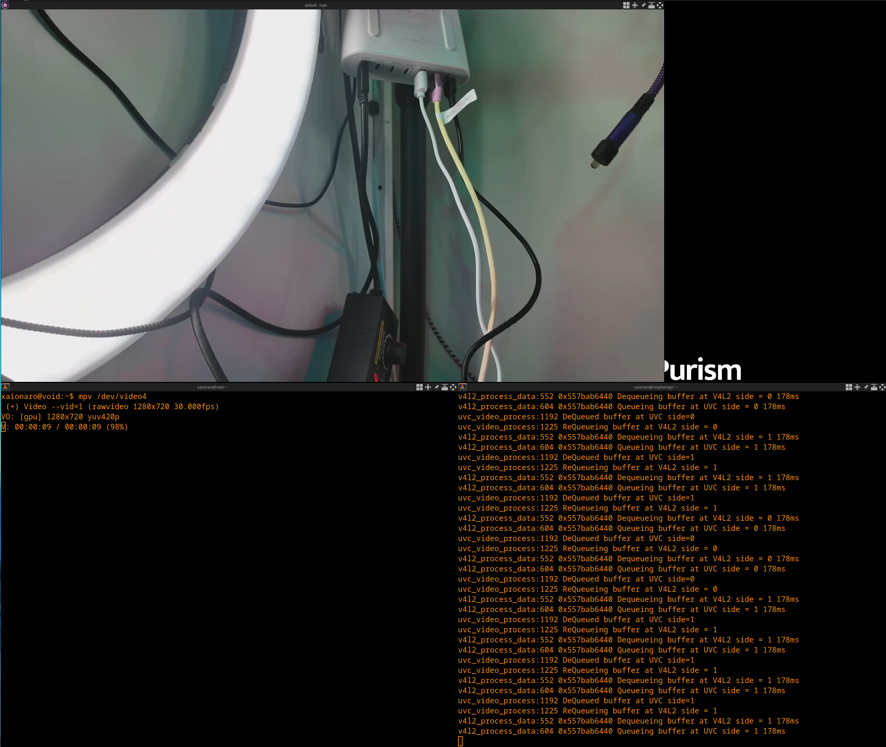

# How to use

## Steps

1. Build `uvc-gadget` with: `make`.
2. Edit the gadget setup script (see `uvc-gadget.sh`). It is currently setup to use pixel format I420.
3. Run the gadget setup script.
4. Setup the source of video. I used: `modprobe v4l2loopback devices=1 video_nr=1 card_label='RTMP-input' && ffmpeg -c:v h264_v4l2m2m -i rtmp://mydomain/mypath -f v4l2 /dev/video1`
5. Run the `uvc-gadget` binary. I used `uvc-gadget -f1 -s2 -u /dev/video0 -v /dev/video1` on my RPi Zero 2W.

## Build `uvc-gadget`

- host:
    `make`
- Cross compile:  
    `make ARCH=arch CROSS_COMPILE=cross_compiler`
    eg:  
    `make ARCH=arm CROSS_COMPILE=arm-hisiv600-linux-`
- or:  
    set `ARCH`, `CROSS_COMPILE`, `KERNEL_DIR` in Makefile

## The `uvc-gadget` binary

```
Usage: ./uvc-gadget [options]
Available options are
 -b		Use bulk mode
 -d		Do not use any real V4L2 capture device
 -f <format>    Select frame format
	0 = V4L2_PIX_FMT_YUYV
	1 = V4L2_PIX_FMT_YUV420 (YU12)
	2 = FRAMEBASED_FMT
	3 = V4L2_PIX_FMT_MJPEG
 -h		Print this help screen and exit
 -i image	MJPEG image
 -m		Streaming mult for ISOC (b/w 0 and 2)
 -n		Number of Video buffers (b/w 2 and 32)
 -o <IO method> Select UVC IO method:
	0 = MMAP
	1 = USER_PTR
 -s <speed>	Select USB bus speed (b/w 0 and 2)
	0 = Full Speed (FS)
	1 = High Speed (HS)
	2 = Super Speed (SS)
 -t		Streaming burst (b/w 0 and 15)
 -u device	UVC Video Output device
 -v device	V4L2 Video Capture device
```

# Screenshots
